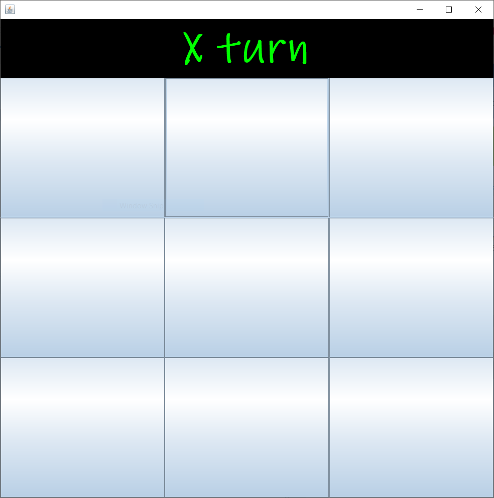
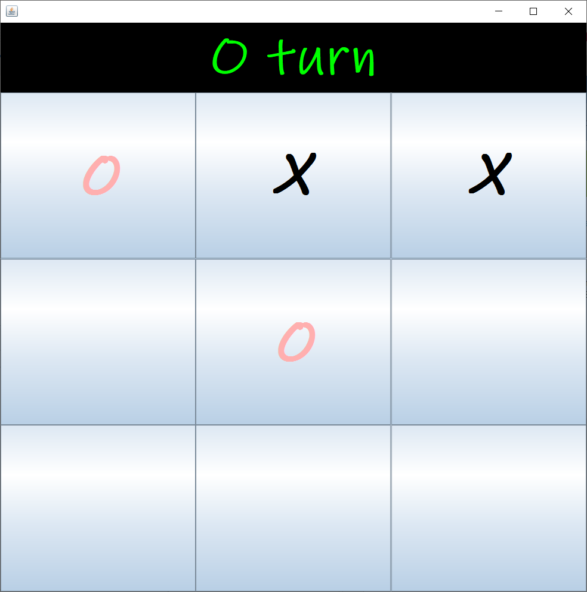
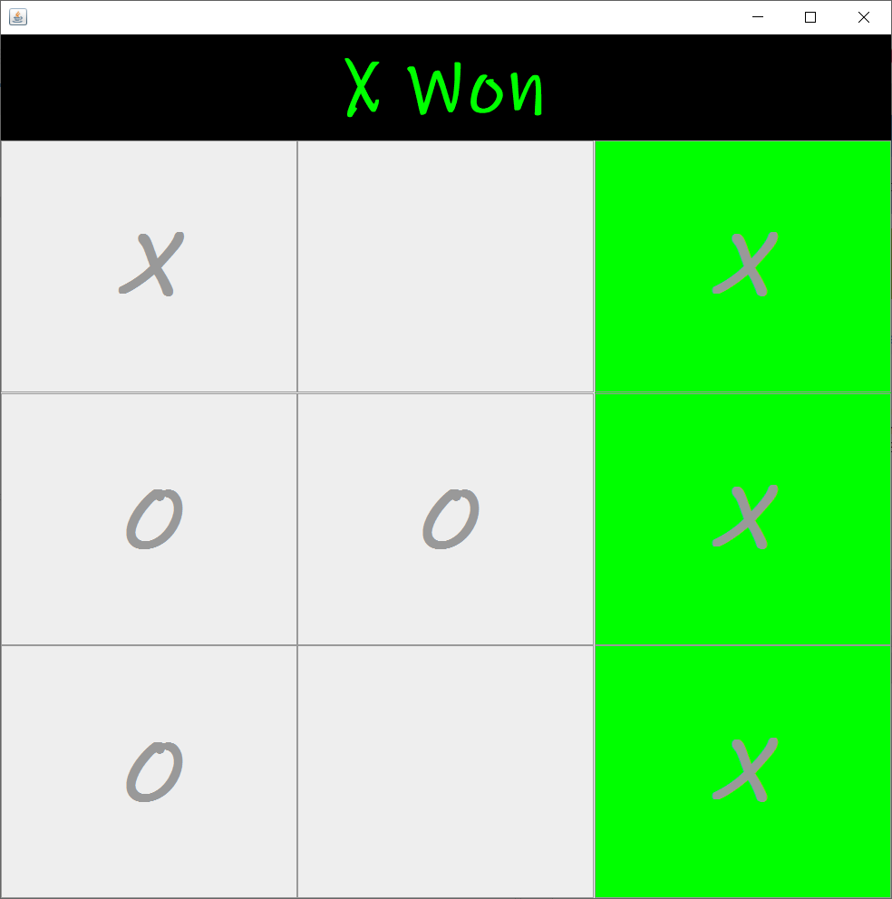

# TicTacToe

TicTacToe is a paper and pencil game which should be played with 2 players only X's and O's. The player who successfully placed their marks in 3 consecutive boxes whether it can be horizontally, vertically or diagnolly.

